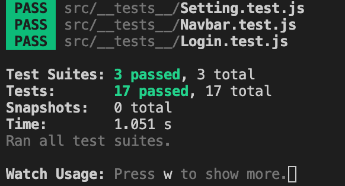

# Database Test

Date: 3.18.2022

| Test Case ID | Name of Person testing | Pass/Fail | Comments                                                |
| :------------- | ------------------------ | ----------- | --------------------------------------------------------- |
| 1            | Nana                   | Fail      | Error in database connection                            |
| 2            | Nana                   | Fail      | Client does not accept authentication protcal           |
| 3            | Nana                   | Pass      | User Table created with required columns for data entry |
| 4            | Nana                   | Pass      | User database created with required collections         |
| 5            | Nana                   | Pass      | database successfully created                           |
| 6            | Nana                   | Pass      | /                                                       |
| 7            | Nana                   | Pass      | User Setting is correctly added                         |
| 8            | Miao                   | Pass      | data entry appears in database                          |

# API Test

Date: 3.18.2022

| Test Case ID | Name of Person testing | Pass/Fail | Comments                                                                                                               |
| -------------- | ------------------------ | ----------- | ------------------------------------------------------------------------------------------------------------------------ |
| 1            | Precious               | Fail      | Error occured when executing the query command                                                                         |
| 2            | Precious               | Fail      | API returns the result without proper response code                                                                    |
| 3            | Precious               | Pass      | Login API return 200 code when the username and password matched the row in the database                               |
| 4            | Precious               | Pass      | Login API return 401 code when the username and password does not match any row in the database                        |
| 5            | Precious               | Pass      | Signup API return 200 code when the username is not found in the database                                              |
| 6            | Precious               | Pass      | Signup API return 401 code when the username found in the database and returns duplicate username as the response body |
| 7            | Precious               | Pass      | Pagination API return "page=" when the next page is clicked                                                            |
| 8            | Precious               | Pass      | Integration testing for setting return user data when a existing user is logged in                                     |
| 9            | Precious               | Pass      | Integration testing for setting return general data when a no user is logged in                                        |

# UX Test

Date: 3.21.2022

| Test Case ID | Name of Person testing | Pass/Fail | Comments                                                                            |
| :------------- | ------------------------ | ----------- | :------------------------------------------------------------------------------------ |
| 1            | Miao                   | Fail      | Login button does not redirect user to the correct page                             |
| 2            | Miao                   | Fail      | Username not displaying after login                                                 |
| 3            | Miao                   | Fail      | Logout button not displayed after logged in                                         |
| 4            | Miao                   | Pass      | Return 200 code and correct response when correct combination is submitted in login |
| 5            | Miao                   | Pass      | Display error message when wrong combination is submitted in login                  |
| 6            | Miao                   | Pass      | Return 200 code when a non duplicate username is registered                         |
| 7            | Miao                   | Pass      | Display error message when trying to register a pre-exist user                      |
| 8            | Miao                   | Fail      | Password requirements are not mandatory                                             |
| 9            | Miao                   | Pass      | username and password are required in login                                         |
| 10           | Miao                   | Pass      | username and password are required in Register                                      |
| 11           | Nana                   | Pass      | User Table created with required columns                                            |
| 12           | Nana                   | Pass      | Display error message when search data entry doesn't meet search criteria           |
| 13           | Nana                   | Pass      | Display user catergory when trying user is logged in                                |
| 14           | Miao                   | pass      | Setting button correctly navigates to the setting page                              |
| 15           | Precious               | pass      | unit test for Setting                                                               |
| 16           | Precious               | pass      | unit test for Navbar                                                                |
| 17           | Nana                   | pass      | unit test for Login                                                                 |
| 18           | Nana                   | pass      | Integration test for api and pagination                                             |
| 19           | Nana                   | pass      | Integration test for pagination after logged in                                     |
| 20           | Miao                   | pass      | Manual test for landing page loading                                                |
| 21           | Miao                   | fail      | Integration Test for prefered articles displaying on home page                      |
| 22           | Miao                   | pass      | Integration Test for prefered articles displaying on home page                      |

Evidence for success unit testing

